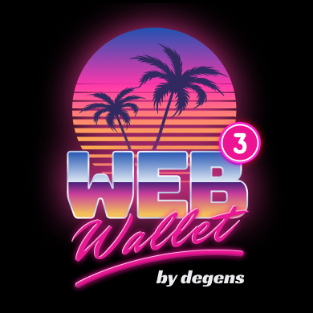
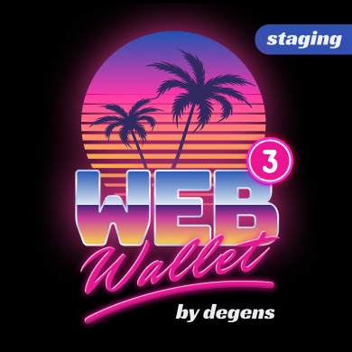
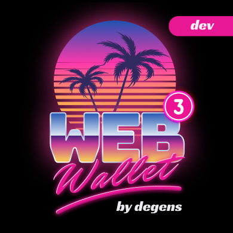

# web3wallet by sons of crypto Ξ

| Prod / AppStore                                        | Staging                                                  | Dev / Nightly                                                 |
|--------------------------------------------------------|----------------------------------------------------------|---------------------------------------------------------------|
|        |   |            |
| web3wallet by sons of crypto Ξ v1.1.5 #51               | web3wallet by sons of crypto S v1.1.5 #51                 | web3wallet by sons of crypto D v1.1.5 #51                     |
| AppStore RC.                                           | New features not quite AppStore ready. Great for testing | Living on the bleeding edge. Latest features, latest bugs. 🐛 |
| [Download](https://testflight.apple.com/join/I4DFVaiH) | [Download](https://testflight.apple.com/join/5GiDXNJ3)   | [Download](https://testflight.apple.com/join/85JEPH96)        |

Live AppStore build link [here (v1.1.3 #47)](https://apps.apple.com/us/app/web3wallet-by-sons-of-crypto-%CE%BE/id6464587288)
. All three builds can be installed simultaneously. For more info about web3wallet
head over to [sonsofcrypto.com](https://sonsofcrypto.com/). 

# Release Notes 

### v1.2.0 #52
- Factoring out integrations
- ExtKeySigner clean up
- MnemonicSigner clean up
- FeeData tweaks
- Additional provider tests
- Additional transaction tests

### v1.1.5 #51
- Removing unused fonts
- Migrating to Kotlin 1.9.23
- Android Studio build fixes
- Fixing pokt config

### v1.1.4 #49
- Wallet type indicator icon
- Swipe up / down to show wallets search bar
- Legacy transaction support
- EIP-2718 support
- EIP-2930 support
- EIP-155 support
- RLP decoding support
- MessageSign personal tests
- Additional transaction tests
- Signer refactor
- VoidSigner
- KeySigner
- ExtKeySigner
- MnemonicSigner
- Address validation fixes

### v1.1.3 #47 Address / View only wallets
- Address / View only wallets
- Show wallet name in title bar
- Deploy transaction address crash fix
- Making content offset consistent
- Removing unused elements 
- NFTDetail module refactor

### v1.1.2 #45 Prv & Xprv key accounts imports & bug fixes
- Import prv & xprv keys
- Theme color consolidation & clean up
- Mnemonic confirm keyboard fix
- Fixing currency type error
- Switching to WalletServiceMultiCall
- Uniswap crash fix
- Hidden content cell refactor

### v1.1.1 #42
- Metadata downloader renaming uppercase file extensions
- Reduce size of metadata cache by ~66%, increase load speed by ~3x 
- Alert when create multiple account at the same time
- Global expert mode in settings
- Added icons to settings
- Setting moved to CollectionViewController
- Fix reload key dev option
- Tests clean up
- Fixing search field at currency screen
- Fixing scrolling to item when keyboard appears

### v1.1.0 #36
- Deriving standard accounts
- Deriving account at custom path1
- Viewing private key (hex, xpriv)
- Reordering wallets 
- Hiding wallets
- Searching wallets
- Expert mode
- Entropy size control
- Universal sheet control
- Universal toasts
- Account management shortcuts in signers
- Improving addresses and derivation paths display
- Keyboard accessory refactor
- Words suggestions refactor
- Overhaul of metadata management
- Generic collection controller
- Generic Button refactor
- Migrating cells to generic type
- Generic animated reloading 

### v1.0.1 #30
- Adding "web3wallet stand for" to settings 
- Settings Module Refactor
- Settings UI refactor
- CollectionViewModel (Sharing more UI Level components)
- Removed classed no longer in use
- Removed assets no longer in use
- Theme optimizations 
- Fixed broken constraints across the app ()
- Updated blur view
- Connecting NFTs navigation
- Fix collection name visibility
- Adding section headers for NFts Dashboard
- Optimized NFT loading
- Placeholder for collections without image
- Fixing L symbol in degen section
- UI Tweaks sections
- Carousel size option

### v1.0 #28

Initial open beta MVP release of the most cypherpunk web3 wallet.
- web3 secret storage, bip39, bip44
- web3lib kotlin multiplatform web3 labrary loosely based on [ethersjs](https://github.com/ethers-io/ethers.js)
- ERC20s & NFTs support
- [Pokt.Network](https://www.pokt.network/), [Alchemy](https://www.alchemy.com/) support
- Vote on next features via WIPs in app
- Native [Uniswap](https://uniswap.org/) v3 swap integration. Interacts with smart contracts directly.
- Native [Cult DAO](https://cultdao.io/) governance integration.
- Four wild themes

Security note: All the cryptographic primitives / functions sercureRand, signing
etc are handled via very same code  
[Go Ethereum](https://github.com/ethereum/go-ethereum) uses. Binded to Kotlin 
Multiplatform via `coreCrypto` wrapper library using 
[gomobile](https://pkg.go.dev/golang.org/x/mobile/cmd/gomobile).

## by degens for degens

  
   <a href="https://sonsofcrypto.com">sonsofcrypto.com</a>

